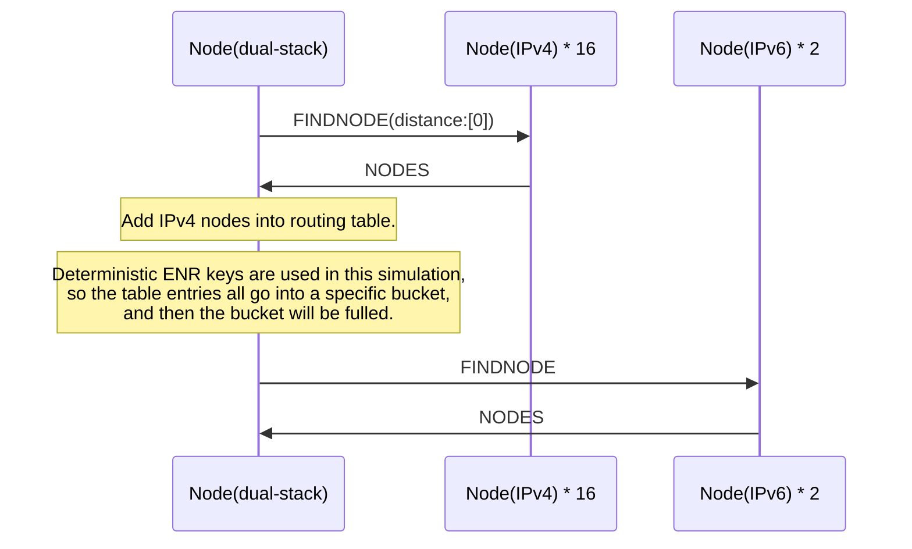

# discv5-dual-stack

A simulation with IPv4/IPv6 dual-stack nodes.

```mermaid
sequenceDiagram
    Node(dual-stack)->>Node(IPv4) * 16: FINDNODE(distance:[0])
    Node(IPv4) * 16->>Node(dual-stack): NODES
    Note over Node(dual-stack): Add IPv4 nodes into routing table.
    Note over Node(dual-stack): Deterministic ENR keys are used in this simulation, <br> so the table entries all go into a specific bucket, <br> and then the bucket will be fulled.
    Node(dual-stack)->>Node(IPv6) * 2: FINDNODE
    Node(IPv6) * 2->>Node(dual-stack): NODES
```